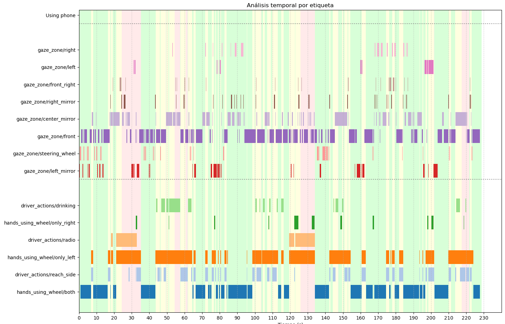

# 2024-tfg-arantxa-garcia

## Prerequisitos

Asegúrate de tener instaladas las siguientes librerías (puedes hacerlo con `pip install <paquete>`):

pip install numpy pandas matplotlib seaborn scikit-learn opencv-python mediapipe torch ultralytics requests Pillow joblib

### Paquetes de Python necesarios

- numpy — procesamiento numérico
- pandas — manejo de datos y DataFrames
- matplotlib — visualización
- seaborn — visualización avanzada
- scikit-learn — modelos de clasificación y métricas (incluye RandomForestClassifier, OneVsRestClassifier, etc.)
- opencv-python — procesamiento de imágenes y vídeo (importado como cv2)
- mediapipe — procesamiento de pose y cara
- torch — deep learning
- ultralytics — detección de objetos YOLO
- requests — peticiones HTTP
- Pillow — procesamiento de imágenes (PIL)
- joblib — guardar y cargar modelos
- copy — módulo estándar (no necesita instalarse)
- collections — módulo estándar
- math — módulo estándar
- random — módulo estándar
- time, datetime, argparse, os, sys, warnings, logging — módulos estándar

### Sesión de prueba

Si quieres probar el archivo united_models.py, es necesario descargar la sesión desde el siguiente enlace: https://urjc-my.sharepoint.com/:f:/g/personal/a_garciab_2021_alumnos_urjc_es/EosX4eFs4MNOpyDaUsQkb4kBaG-NJ__lF3lEultgaIZnag?e=w9RxjD

### Notas adicionales

- Los módulos como copy, math, random, time, os, sys, collections, etc. son estándar de Python y no necesitan instalación.
- Si usas YOLO de ultralytics, asegúrate de instalar correctamente:

pip install ultralytics

y verificar la versión compatible.

## Funcionamiento

Como se ha explicado, es necesario tener descargada la sesión `1_s1` y ejecutar el siguiente comando en la terminal:

$ python united_models.py

Este proceso generará un archivo llamado 'prediction_timeline.json' (que ya está disponible en el repositorio).

A continuación, para visualizar la gráfica con la evolución del estado de distracción del conductor durante la sesión, ejecuta:

$ python cronologia.py

Esto mostrará la gráfica que representa la valoración del nivel de distracción del conductor a lo largo de toda la sesión, tal como se muestra a continuación:

