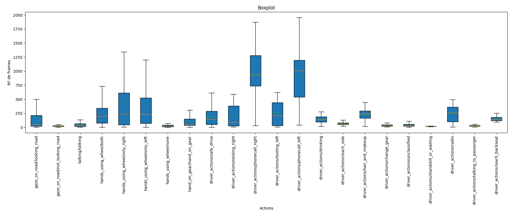
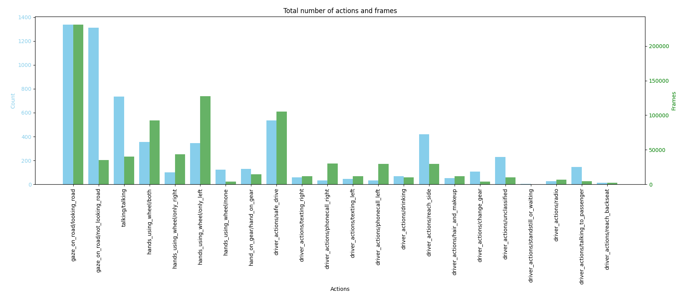

He avanzado bastante en este mes así que voy a ir enseñando poco a poco lo que he ido avanzando:

# Plots

He creado un fichero llamado plotJson para poder ver un poco la información con la que cuento en general. Este fichero necesita un directorio con los Json de los que quiere saber la información y te da dos plots:

## BoxPlot

Este plot nos dice la media y la mediana durante la que aparece cada acción en cada Json. También nos dice el valor mínimo y máximo de tiempo que aparecen las distintas acciones y nos ayuda a hacernos una idea general de como se distribuyen los datos. Podemos ver el ejemplo con el que de momento estoy trabajando a continuación:

## Cantidad de frames y actions

Aquí tenemos otro tipo de plot, esta vez de barras. Hay dos barras, la primera representa la cantidad de veces que sale mencionada cada accion en los json, la segunda la cantidad de frames en los que aparece cada accion en Json. El conjunto de ambas cosas nos ayuda a hacernos una idea de que tan balanceados están nuestros datos y qué partes tenemos que recortar para poder equilibrarlo:

# --Combine

Ahora volvemos a videohands.py, a la última opción que creamos: --combine. Esta opción lo que hacía era unificar los tres videos para poder visualizarlos como uno solo. Gracias a ésto la última vez nos dimos cuenta que los videos no iban sincronizados. Ésto es lo que hemos solucionado para esta opción éste mes:

Los hemos sincronizado gracias a la creación de unas variables que se quedaban con el frame en el que debía empezar cada vídeo. Ahora se quedan con la pantalla en negro hasta que les toca empezar realmente.

# --load_json

Ésta opción es nueva, lo que hace es guardar los datos en tres json distintos, uno para cada cámara. Tarda un rato en terminarse los vídeos enteros. He tenido que elegir que puntos guardar para que no se me sobrecargue. Al principio tardaba muchísimo porque escribía en los json en cada iteración y cada vez iba tardando mas según se iban llenando de líneas, ahora escribo cada 400 iteraciones.