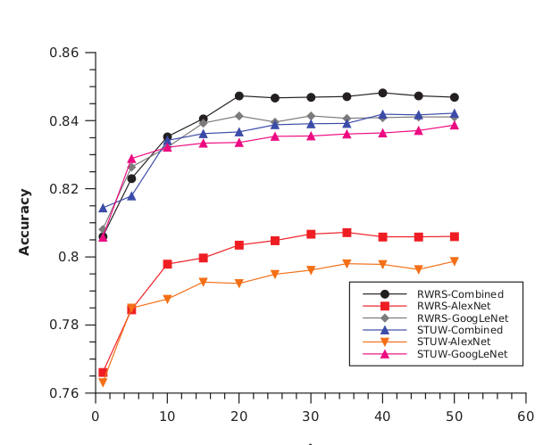

## Recogida de datos

Esta semana he acabado de perfeccionar la recolección de datos en mi programa. Lo hice en tres json distintos, uno para la información de cada cámara. He tenido que volver a aprender bien como funcionaban los json para poder crearlos y rellenarlos de manera correcta. He decidido guardar todos los puntos menos los de la cara, que eran más de 400. Para éstos últimos he utilizado una reducción y me he quedado con 28, los más significativos.

## Reconstructor

He creado una nueva clase llamada reconstructor, que me ha servido para coger los puntos guardados en los json de los que he hablado antes y pintarlos en los videos. Gracias a esto, he podido comprobar que he guardado los datos de manera correcta.

## Estado del arte

Aquí voy a ir poniendo la información que he encontrado de distintos papers sobre como usar secuencias de frames para detectar qué está haciendo:

--Beyond Short Snippets: Deep Networks for Video Classification:

In order to learn a global description of the video while
maintaining a low computational footprint, we propose pro-
cessing only one frame per second. At this frame rate, im-
plicit motion information is lost. To compensate, follow-
ing [19] we incorporate explicit motion information in the
form of optical flow images computed over adjacent frames.
Thus optical flow allows us to retain the benefits of motion
information (typically achieved through high-fps sampling)
while still capturing global video information. Our contri-
butions can be summarized as follows:
1. We propose CNN architectures for obtaining global
video-level descriptors and demonstrate that using in-
creasing numbers of frames significantly improves
classification performance.
2. By sharing parameters through time, the number of pa-
rameters remains constant as a function of video length
in both the feature pooling and LSTM architectures.
3. We confirm that optical flow images can greatly bene-
fit video classification and present results showing that
even if the optical flow images themselves are very
noisy (as is the case with the Sports-1M dataset), they
can still provide a benefit when coupled with LSTMs.
Leveraging these three principles, we achieve state-of-
the-art performance on two different video classification
tasks: Sports-1M (Section 4.1) and UCF-101 (Section 4.2).

-- Video classification using compacted dataset based
on selected keyframe

video classification system by combining the keyframe extractor system
and convolutional neural network (CNN) classifier

