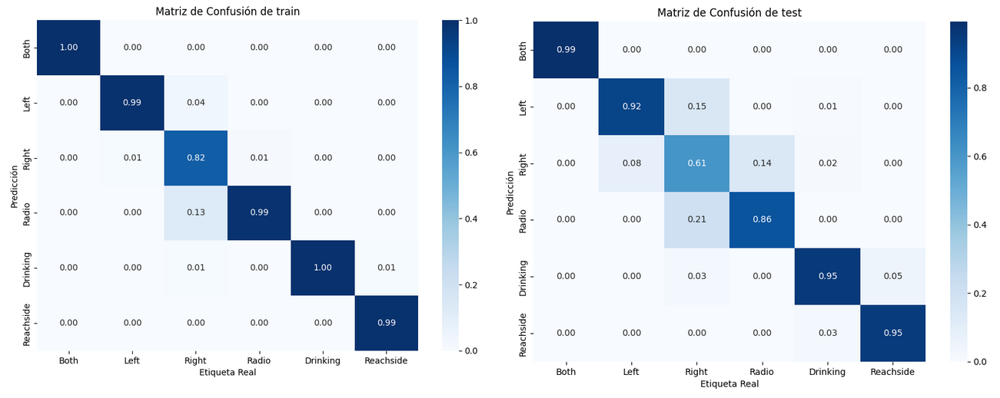
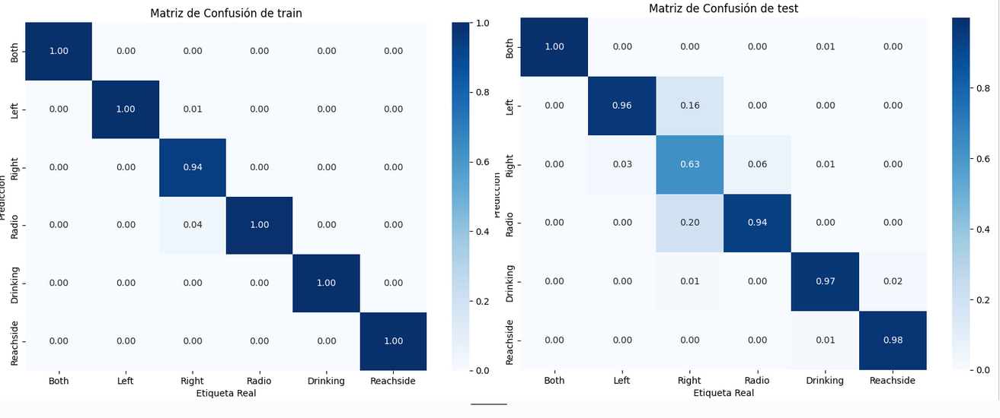

Este mes empecé las prácticas así que avancé un poco menos con el TFG. Igualmente os cuento a continuación los avances que hice:

Ya con el test y train separado en distintas personas, buscamos mejorar al máximo posible el dataset para conseguir mejores resultados. Las primeras matrices de test y train nos dan los siguientes resultados:

Esta matriz nos ayudó a decidir que sí podíamos conseguir un modelo que generalizase bien con todas las acciones, aunque todavía no funcionase bien del todo por la acciones de solo mano derecha.

Lo siguiente que decidimos fue añadir ruido gaussiano y una traslación para tener más datos y que pudiese generalizar mejor. Gracias a eso obtuvimos la siguiente matriz:

Aún fallaba en la acción derecha pero al menos el train mejoraba